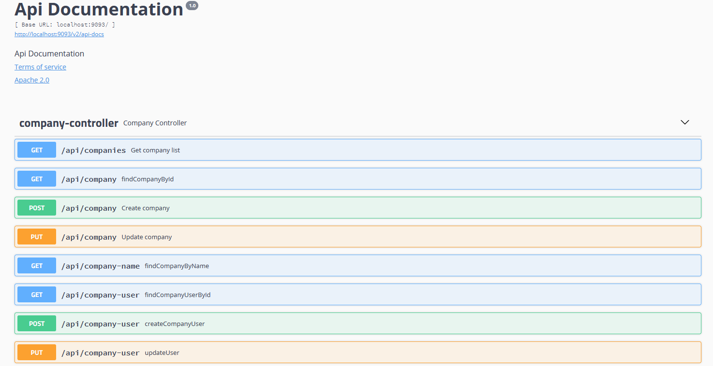

# Spring Multi-Multi-Module Application

## Features:
 1. Spring MVC
 2. Spring JPA Mapping
 3. Springfox Swagger UI for documentation
 5. Exception Handling,
 6. REST Web Service

## Swagger UI:
* 
* http://localhost:9093/swagger-ui.html#
